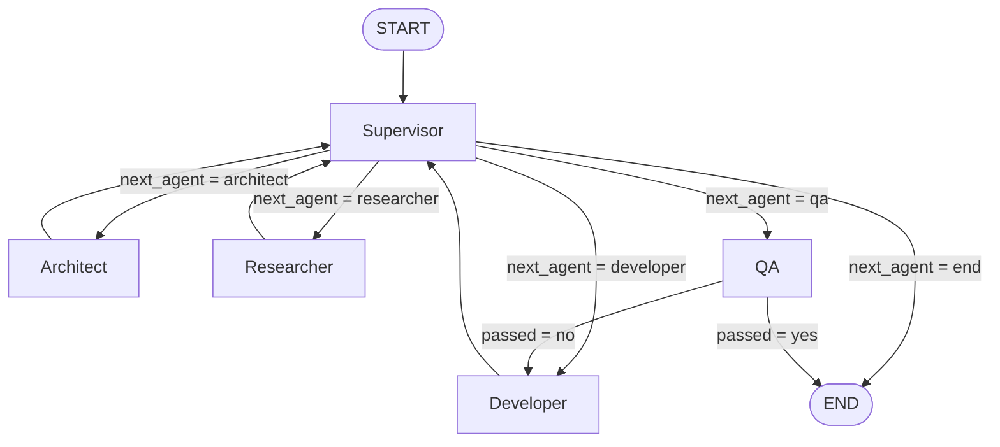

# Multi Agent Software Development Team

This project is an agentic software development workflow built with LangGraph and LLM-powered agents. It takes a user requirement and guides it through a multi-step delivery pipeline involving architecture design, research, implementation, review, and QA.

## Project idea

The system behaves like an AI software team:

- The Supervisor decides what should happen next.
- The Architect designs the technical solution.
- The Researcher gathers tech recommendations and risks.
- The Developer implements the feature.
- The QA agent validates the result.
- The workflow loops until the requirement is satisfied or the iteration limit is reached.

## Agent graph


## Developer file tools

The Developer can use three tools while implementing a requirement:

- `analyze_folder` lists existing files in the destination folder.
- `create_file` creates a new project file and refuses to overwrite an existing file.
- `edit_file_lines` replaces an inclusive, 1-based line range in an existing file.
- `delete_file_lines` removes an inclusive, 1-based line range from an existing file.

All paths are restricted to the project directory. Tool results are passed back to
the Developer before it returns the implementation summary.

## Persistent project memory

After a workflow completes, the system stores project-specific memory in a SQLite
database at:

```text
<project_directory>/.agents/project_memory.db
```

When a project directory is received, the system checks for this database first.
The next request for the same directory loads this memory and provides it to
the Architect, Researcher, Developer, Supervisor, and QA agents. It contains the
latest requirement, architecture, research, implementation, review, and QA
results, and is separate for every project directory. Older databases under
`.agent` are still read for compatibility. SQLite is provided by Python's
standard library, so no extra package is required.

## Role breakdown

### Supervisor
The Supervisor acts as the tech lead or project manager. It decides the next agent to invoke based on the current state of the project. It also enforces a maximum iteration cap and can end the workflow once QA passes.

### Architect
The Architect receives the project requirement and produces a practical technical architecture. It focuses on:

- backend framework
- application components
- APIs
- database design
- tech stack decisions

### Researcher
The Researcher evaluates the architecture and requirement to suggest relevant tools, libraries, best practices, and technical risks. This helps the Developer implement with better decisions without overengineering.

### Developer
The Developer implements the actual software based on the requirement, architecture, and research insights. It updates the project state with implementation files and explanation.

### QA
The QA agent reviews the implementation against the requirement and architecture. It decides whether the implementation passes and recommends fixes when it does not.

## Workflow behavior

1. Execution begins at the Supervisor.
2. The Supervisor selects the next task based on missing state.
3. The Architect and Researcher create design and guidance.
4. The Developer builds the implementation.
5. The Supervisor can perform a code review before QA.
6. QA checks whether the implementation is acceptable.
7. If QA passes, the workflow ends.
8. If QA fails, the system sends the work back to the Developer for revision.

## State model

The project state keeps track of:

- requirement
- architecture
- research
- implementation
- qa result
- supervisor review
- iteration count
- next agent
- supervisor reasoning

This makes the graph stateful and allows the agent loop to reason over incremental progress.

## Implementation files

- [src/graph/workflow.py](src/graph/workflow.py) defines the LangGraph workflow and conditional routing.
- [src/graph/state.py](src/graph/state.py) defines the state schema.
- [src/agents/supervisor.py](src/agents/supervisor.py) contains the team orchestration logic.
- [src/agents/architect.py](src/agents/architect.py) defines the architecture agent.
- [src/agents/researcher.py](src/agents/researcher.py) defines the research agent.
- [src/agents/developer.py](src/agents/developer.py) defines the implementation agent.
- [src/agents/qa.py](src/agents/qa.py) defines the QA agent.

## Setup instructions

### 1. Create a virtual environment

```bash
python -m venv .venv
```

Activate it:

```bash
# Windows
.venv\Scripts\activate

# macOS / Linux
source .venv/bin/activate
```

### 2. Install dependencies

```bash
pip install -r requirements.txt
```

### 3. Add your Gemini API key

Create a file named `.env` in the project root and add:

```env
GEMINI_API_KEY=your_api_key_here
MODEL=gemini-2.5-flash
```

You can change the model name if you want to use a different Gemini model supported by your account.

### 4. Run the app

Start the FastAPI server:

```bash
uvicorn main:app --reload
```

Then send a POST request to:

```text
http://127.0.0.1:8000/projects
```

Example JSON body:

```json
{
  "requirement": "Build a simple todo API in Python with FastAPI",
  "project_directory": "C:/projects/generated_todo_api"
}
```

`project_directory` must be an existing directory. Generated files use paths
relative to that directory, and the file tools cannot write outside it.

The API will return the generated architecture, research notes, implementation, QA status, and iteration details.

## Summary

This repository is a small multi-agent development loop that mimics a real software team. It is a practical example of agentic orchestration: plan, research, build, review, and validate in a loop until the desired result is reached.

> **Note:** This is a learning project built by following along with and adapting concepts from [this tutorial video](https://www.youtube.com/watch?v=91Jl0V7hqUU).

